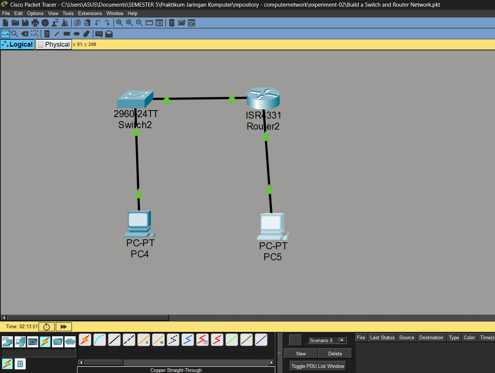
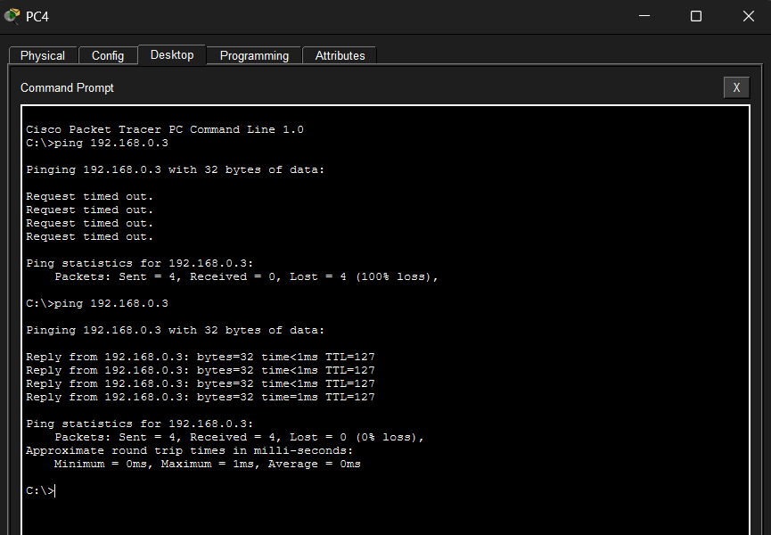
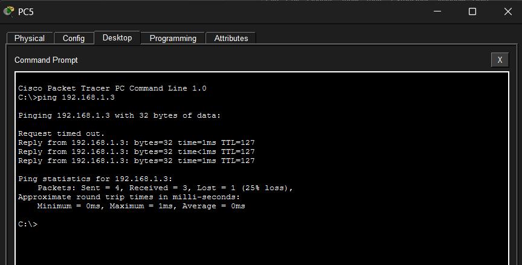
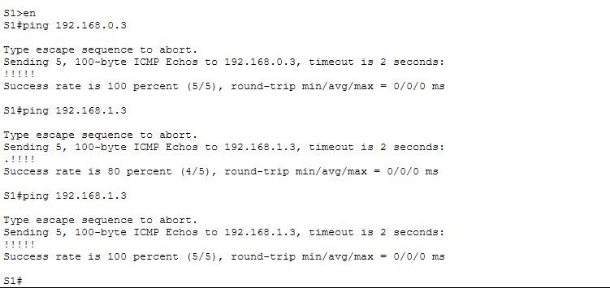
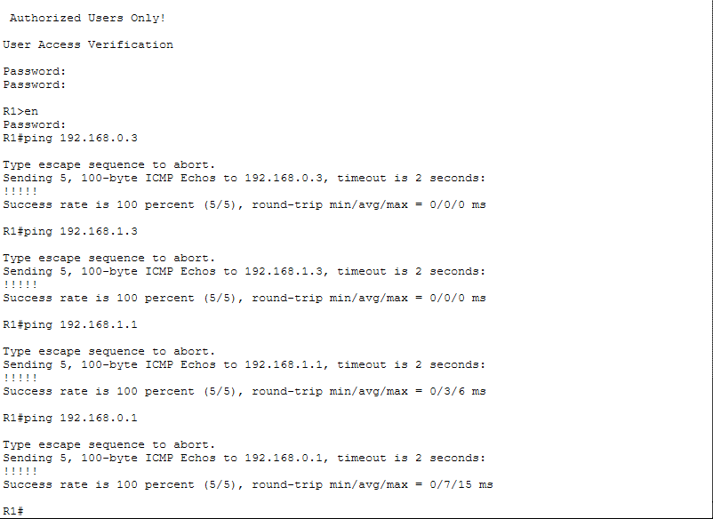

# Judul Percobaan: [Build a Switch and Router Network]

## 👨‍💻 Identitas Mahasiswa
- **Nama:** Firman Farel Richardo
- **NPM:** 2315061099
- **Kelas:** PJK B

---

## 📺 Demonstrasi YouTube
Berikut adalah tautan video yang mendemonstrasikan proses konfigurasi dan hasil akhir dari percobaan ini.

➡️ **[Tonton Video Demonstrasi di YouTube](https://youtu.be/qXFIdueuPKE)**

---

## 📁 File Konfigurasi (.pkt)
File simulasi jaringan (.pkt) yang digunakan untuk percobaan ini dapat diakses pada tautan berikut. File ini berisi seluruh topologi dan konfigurasi yang telah selesai.

- **[NamaFilePercobaan.pkt](./Build a Switch and Router Network.pkt)**

---

## 📸 Screenshot Hasil Percobaan
Berikut adalah dokumentasi visual dari langkah-langkah penting dan hasil akhir dari percobaan ini.

### 1. Desain Topologi Jaringan

### 2. Tes Ping PC-A

### 3. Tes Ping PC-B

### 4. Tes Ping Switch S1

### 5. Tes Ping Router R1

