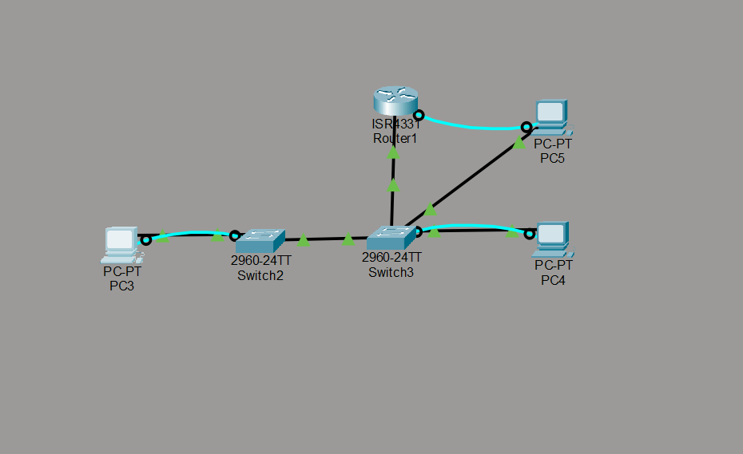
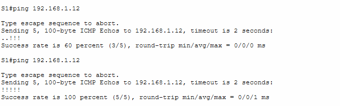
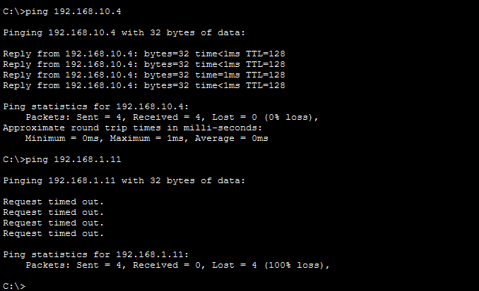
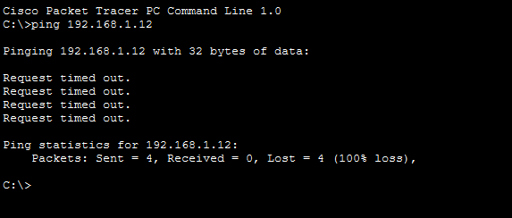

# Judul Percobaan: VLAN

## 👨‍💻 Identitas Mahasiswa
- **Nama:** Firman Farel Richardo
- **NPM:** 2315061099
- **Kelas:** PJK B

---

## 📺 Demonstrasi YouTube
Berikut adalah tautan video yang mendemonstrasikan proses konfigurasi dan hasil akhir dari percobaan ini.

➡️ **[Tonton Video Demonstrasi di YouTube](https://youtu.be/TODyIsVYUvM?si=4eTen_I9MXbj8RUH)**

---

## 📁 File Konfigurasi (.pkt)
File simulasi jaringan (.pkt) yang digunakan untuk percobaan ini dapat diakses pada tautan berikut. File ini berisi seluruh topologi dan konfigurasi yang telah selesai.

- **[NamaFilePercobaan.pkt](./final-assignment.pkt)**

---

## 📸 Screenshot Hasil Percobaan
Berikut adalah dokumentasi visual dari langkah-langkah penting dan hasil akhir dari percobaan ini.

### 1. Desain Topologi Jaringan

### 2. Pengujian Konektivitas (Ping)

